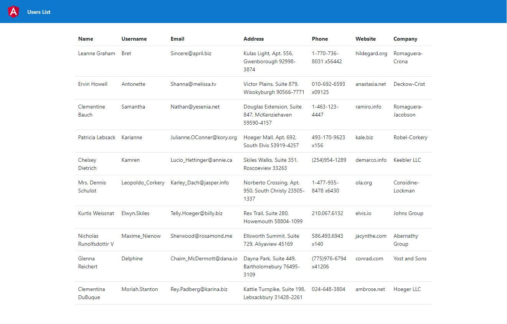

# RBC Interview Assignment

## The Angular solutions is in user-list
### Angular folder has the below structure
- App
  - models/
    - index.ts
    - user.model.ts -- has the user model interface
  - service/
    - user.service.ts -- the main service to do a http request and fetch the data
    - user.service.spec.ts -- unit tests using karma/jasmine
  - app.component.ts -- the logic to generate the data from API
  - app.component.html -- to view the user list in a table format
  - app.component.spec.ts -- unit test for the app component
  
Below is the screenshot for the running application and test result

## The C# unit tests solution is in APITest and API
- API Test is used for unit testing using the xUnit framework
- API has the actual code to call the user posts.

### The unit test covers
    - Test that GetAllUserPost returns all user posts when they exist in the API
    - Test that GetAllUserPost returns an empty list when no user posts exist in the API
    - Test that GetAllUserPost returns correct data types for all properties
    - Test that GetAllUserPost returns data in the correct format (JSON)
    - Test that GetAllUserPost returns an empty list when the API is unavailable
    - Test that GetAllUserPost returns an empty list when the API returns an error status code (e.g. 500 Internal Server Error) 

